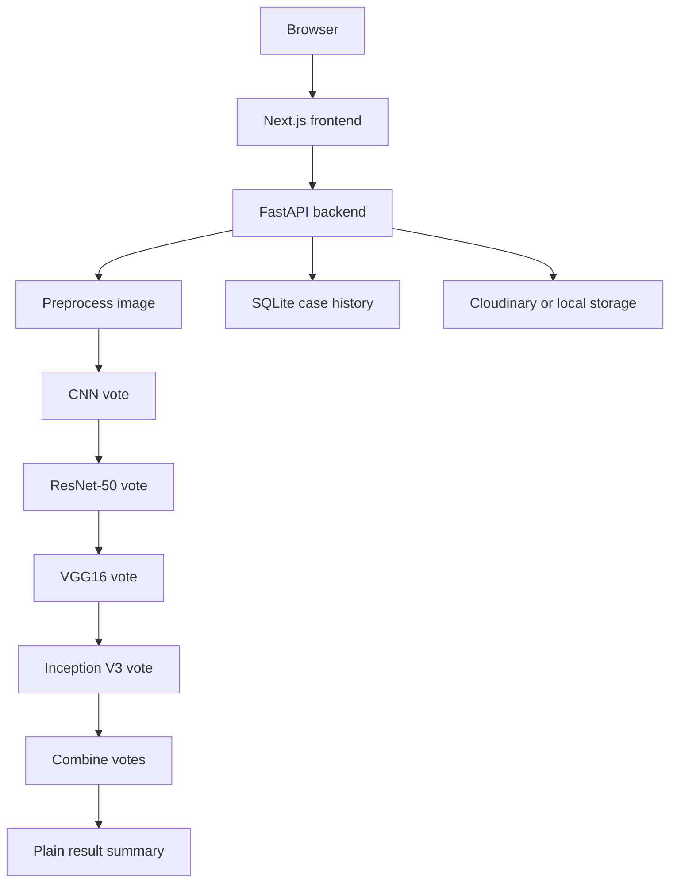
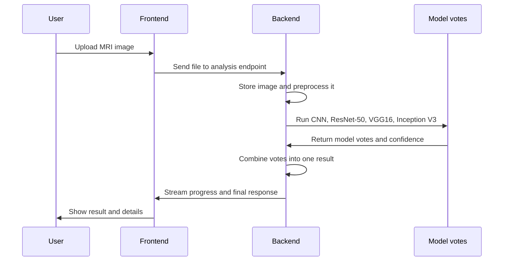
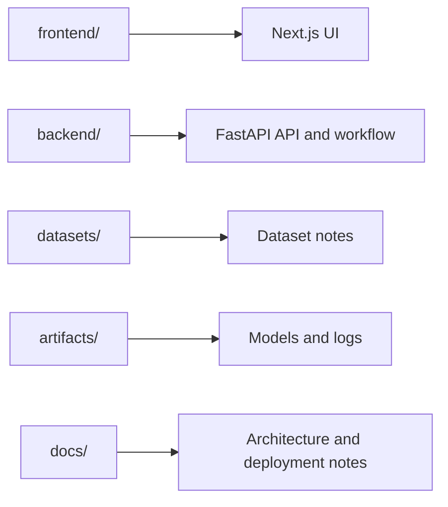
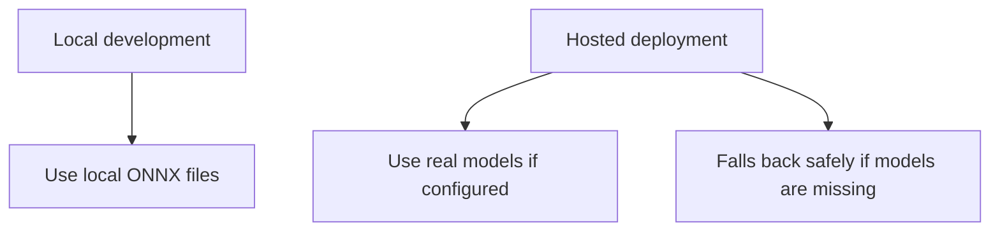

# Brain MRI Tumor Classification and Analysis System

A full-stack brain MRI application that uploads one scan, runs four model votes, combines the result, and shows a plain summary with the main details in one place.

The project is built for two use cases:
- `Local mode`: run everything on your machine with the ONNX models in `artifacts/models/`
- `Hosted mode`: run the frontend on Vercel and the backend on a VPS or Render-style host, with safe fallback behavior if model files are not available

## What It Does

- uploads a brain MRI image from the browser
- preprocesses the image on the backend
- runs four model votes:
  - CNN
  - ResNet-50
  - VGG16
  - Inception V3
- combines those votes into one final class
- shows the result with confidence, class probabilities, and a plain summary
- can also show extra steps such as source lookup, report text, checks, and case history

The predicted classes are:

- `glioma`
- `meningioma`
- `notumor`
- `pituitary`

## Architecture



## Workflow



## Repository Layout



## Local Setup

### Requirements

- Python 3.11
- Node.js 18+
- npm

### Backend

```powershell
cd backend
python -m venv .venv
.venv\Scripts\activate
pip install -r requirements.txt
copy .env.example .env
uvicorn app.main:app --reload --host 127.0.0.1 --port 8000
```

### Frontend

```powershell
cd frontend
npm install
copy .env.local.example .env.local
npm run dev
```

Open:
- Frontend: `http://localhost:3000`
- Backend health: `http://localhost:8000/api/health`

## Local Configuration

### Frontend

`frontend/.env.local`

```env
NEXT_PUBLIC_API_BASE_URL=http://localhost:8000/api
```

### Backend

`backend/.env` is set up for local development by default:

- local ONNX paths point to `artifacts/models/`
- local auth uses a seeded admin account stored in SQLite
- Cloudinary is optional
- extra LLM and retrieval services are optional
- local development uses the real model paths when they are available

## Local vs Hosted Behavior



- Local development is designed to use the four real models.
- Hosted deployments can still run without the model files, which keeps the upload and result flow usable.
- If the model files are present, the UI shows the real model votes.

## UI Features

The frontend shows:
- upload card
- live workflow steps
- result summary
- model votes
- image signals
- optional sources and checks
- case-level details

More details:
- [Frontend README](frontend/README.md)

## Dataset

The local dataset lives in `datasets/brain-tumor-mri/`.

More details:
- [Dataset README](datasets/README.md)

## Models

The trained ONNX files are expected in `artifacts/models/`:

- `cnn.onnx`
- `resnet50.onnx`
- `vgg16.onnx`
- `inception_v3.onnx`

## Storage

- MRI uploads are stored locally in development.
- Cloudinary can be used for durable image storage in hosted setups.
- SQLite stores case history and authentication data.

## Notes

- This is decision support software, not an autonomous diagnosis system.
- The main path stays focused on upload, preprocess, vote, and combine.
- Optional extra steps are still available for sources, report text, checks, and saved cases.

## More Docs

- [Architecture notes](docs/architecture.md)
- [Deployment guide](docs/deployment.md)
- [Dataset notes](datasets/README.md)
- [Frontend notes](frontend/README.md)

