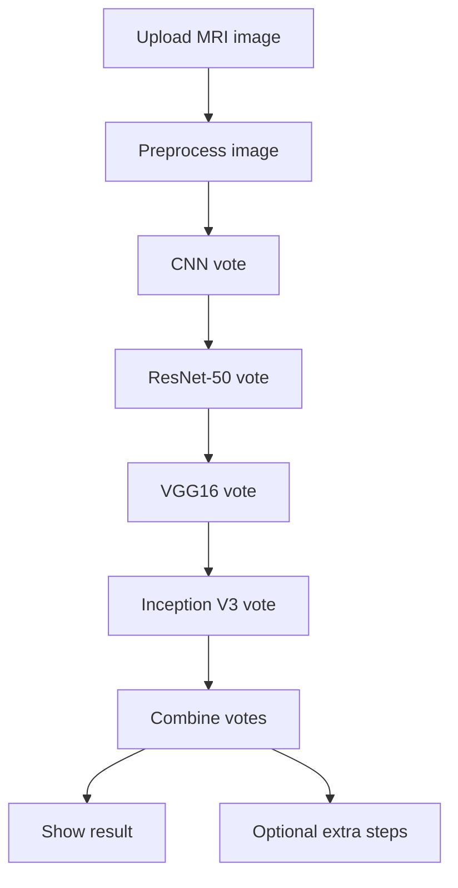
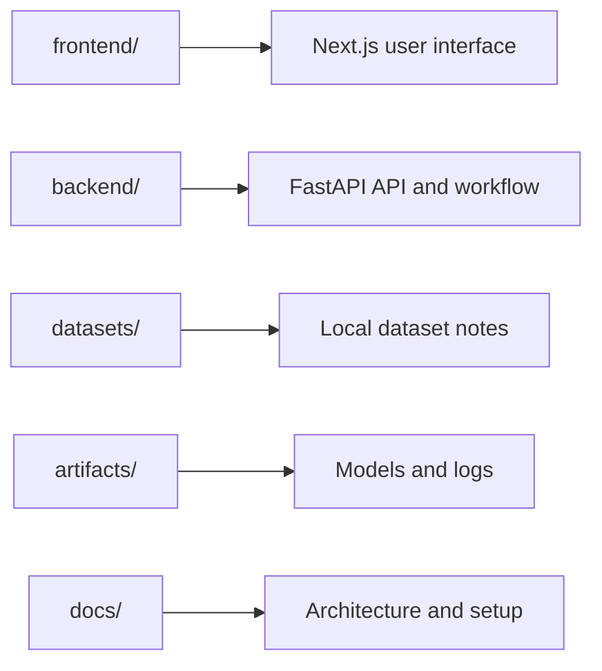
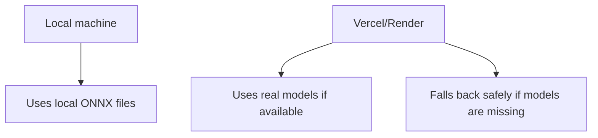

# Brain MRI Tumor Classification and Analysis System

A full-stack brain MRI application that uploads a scan, runs four model votes, combines the result, and shows a plain summary with the main details in one place.

The project is built around two practical modes:
- `Local mode`: runs end to end on your machine with the ONNX models in `artifacts/models/`
- `Hosted mode`: runs on Vercel + Render and falls back safely if the model files are not available

## What It Does

- uploads a brain MRI image from the browser
- preprocesses the image
- runs four model votes:
  - CNN
  - ResNet-50
  - VGG16
  - Inception V3
- combines those votes into one final class
- shows the result with confidence, class probabilities, and a plain summary
- can also show extra steps such as source lookup, report text, checks, and saved case history

The predicted classes are:

- `glioma`
- `meningioma`
- `notumor`
- `pituitary`

## System Flow



## Repository Layout



## Local Setup

### Requirements

- Python 3.11
- Node.js 18+
- npm

### Backend

```powershell
cd backend
python -m venv .venv
.venv\Scripts\activate
pip install -r requirements.txt
copy .env.example .env
uvicorn app.main:app --reload --host 127.0.0.1 --port 8000
```

### Frontend

```powershell
cd frontend
npm install
copy .env.local.example .env.local
npm run dev
```

Open:
- Frontend: `http://localhost:3000`
- Backend health: `http://localhost:8000/api/health`

## Local vs Hosted Behavior



- Local development is set up to use the four real models.
- Hosted deployments can still work without the model files, which keeps the app usable in fallback mode.
- If the model files are present, the same UI shows the real model votes.

## Frontend

The frontend lives in `frontend/` and is a Next.js app.

It shows:
- the upload panel
- the live workflow steps
- the result summary
- the model votes
- the image signals
- the case details

More details:
- [Frontend README](frontend/README.md)

## Dataset

The local dataset is stored under `datasets/brain-tumor-mri/`.

More details:
- [Dataset README](datasets/README.md)

## Architecture

More details:
- [Architecture notes](docs/architecture.md)

## Models

The trained ONNX files are expected in `artifacts/models/`:

- `cnn.onnx`
- `resnet50.onnx`
- `vgg16.onnx`
- `inception_v3.onnx`

## Notes

- This is decision support software, not an autonomous diagnosis system.
- The backend stores uploads locally in development.
- Cloudinary can be used for remote upload storage if configured.
- The optional extra workflow steps are still available, but the main path stays focused on upload, preprocess, vote, and combine.
