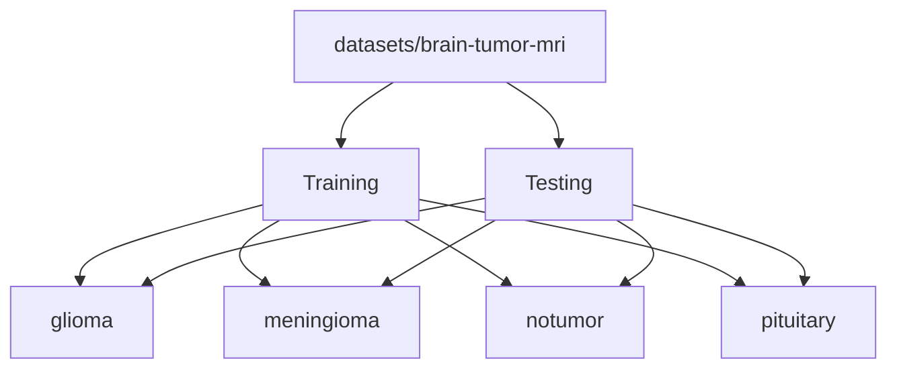

# Dataset

This directory contains the local MRI dataset used for experimentation and future training.

## Structure



```text
datasets/
  brain-tumor-mri/
    Training/
      glioma/
      meningioma/
      notumor/
      pituitary/
    Testing/
      glioma/
      meningioma/
      notumor/
      pituitary/
```

## Purpose

- `Training/` is used for future model training or offline experimentation.
- `Testing/` is useful for validation and demo cases.
- The current app can run without reading this folder at runtime, but the dataset is kept for reproducibility and training work.

## Class Labels

- `glioma`
- `meningioma`
- `notumor`
- `pituitary`

## Source

- Imported locally from `C:\Users\KIIT0001\Desktop\marksheets\archive`

## Recommendation

If you extend the training scripts later, keep any metadata or preprocessing helpers alongside `scripts/` or `docs/` so the raw dataset folders stay clean.

