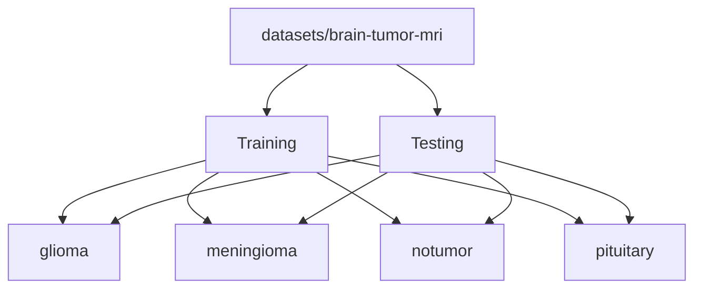

# Dataset

This folder contains the local brain MRI dataset used for training and experimentation.

The dataset is only needed if you want to retrain or inspect the source data. The app itself does not read this folder at runtime in either core mode or full workflow.

## Structure



```text
datasets/
  brain-tumor-mri/
    Training/
      glioma/
      meningioma/
      notumor/
      pituitary/
    Testing/
      glioma/
      meningioma/
      notumor/
      pituitary/
```

## Class Labels

- `glioma`
- `meningioma`
- `notumor`
- `pituitary`

## Purpose

- `Training/` is used for model training and experimentation.
- `Testing/` is used for evaluation and validation checks.
- The app does not read this folder at runtime unless you are retraining.
- Both workflow types use the exported ONNX model files, not the raw dataset folders.

## Source

- Imported locally from `<local project root folder destination>`

## Notes

- Keep the raw dataset folders clean.
- Put any preprocessing helpers or training notes in `scripts/` or `docs/`.
- The class list here matches the four classes used by the app.
- Core mode and full workflow both rely on the same four tumor classes.
