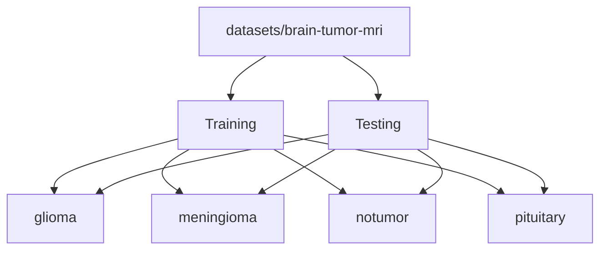

# Dataset

This folder contains the local brain MRI dataset used for experimentation and model training.

## Structure



```text
datasets/
  brain-tumor-mri/
    Training/
      glioma/
      meningioma/
      notumor/
      pituitary/
    Testing/
      glioma/
      meningioma/
      notumor/
      pituitary/
```

## Class Labels

- `glioma`
- `meningioma`
- `notumor`
- `pituitary`

## Purpose

- `Training/` is used for model training and experimentation.
- `Testing/` is used for evaluation and demo checks.
- The app does not read this folder at runtime unless you are retraining.

## Source

- Imported locally from `C:\Users\KIIT0001\Desktop\marksheets\archive`

## Notes

- Keep the raw dataset folders clean.
- Put any preprocessing helpers or training notes in `scripts/` or `docs/`.
- The class list here matches the four classes used by the app.

