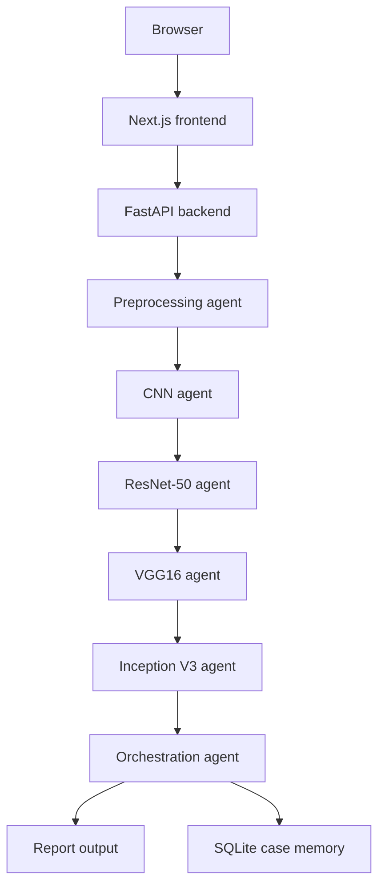

# Architecture

## System View

## Request Flow

1. User uploads an MRI image in the frontend.
2. The frontend sends the file to the backend upload endpoint.
3. The backend stores the image locally or in Cloudinary if configured.
4. Preprocessing extracts MRI features and prepares model input.
5. Four algorithm agents run in sequence.
6. The orchestration agent combines the model votes.
7. The report and case metadata are assembled.
8. The response is streamed back to the UI and persisted locally.

## Modes

### Local Demo Mode

- Uses local paths under `artifacts/models/`
- Can fall back to heuristic outputs if weights are missing
- Keeps the app runnable on a normal laptop

### Model-Backed Mode

- Uses the exported ONNX files
- Runs the actual four-agent classification path
- Produces the same UI flow, but with real model votes

## Storage

- MRI uploads: `storage/uploads/`
- SQLite database: `storage/mri_copilot.db`
- Optional vector store: `chroma/`
- Optional model cache: `storage/model-cache/`

## Safety

- AI-assisted only
- Explicit uncertainty handling
- No autonomous diagnosis
- Optional verifier layer for extended workflows

