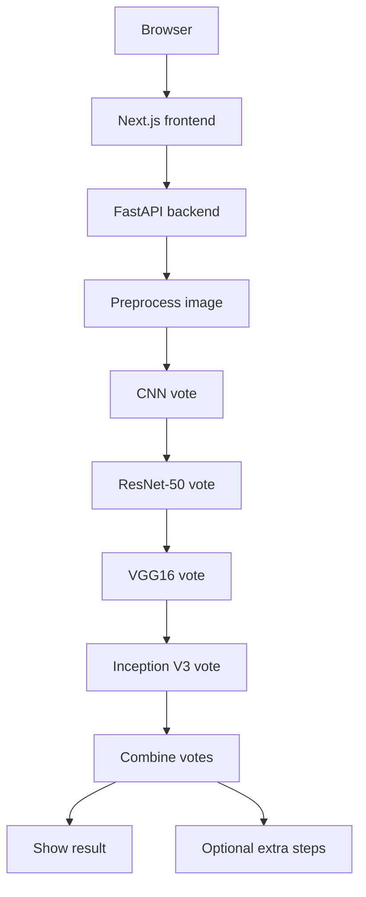

# Architecture

## System View

## Request Flow

1. The user uploads one MRI image in the frontend.
2. The frontend sends the file to the backend using either core mode or full workflow.
3. The backend stores the image.
4. The backend prepares the image for inference.
5. The four model votes run one after another.
6. The backend combines the votes into one result.
7. The backend builds the plain summary, class probabilities, and image signals.
8. If full workflow is selected, the backend also runs source lookup, report generation, checks, and case saving.
9. The result is sent back to the UI.

## Workflow Types

### Core Mode

- upload
- preprocess
- CNN
- ResNet-50
- VGG16
- Inception V3
- combine votes
- return result

### Full Workflow

- core mode steps
- source lookup
- report generation
- result checks
- case saving

## Modes

### Local Mode

- uses the four local ONNX files in `artifacts/models/`
- is meant for development on your machine
- uses the real model path when the files are present

### Hosted Mode

- runs on Vercel and a VPS or Render-style backend
- can still work if the model files are missing
- falls back safely instead of breaking the upload flow
- can still expose the full workflow if the extended routes are available

## Storage

- MRI uploads: `storage/uploads/`
- SQLite database: `storage/mri_copilot.db`
- Optional vector store: `chroma/`
- Optional model cache: `storage/model-cache/`

## Notes

- The main path stays focused on upload, preprocess, vote, and combine.
- Extra steps are available in the full workflow, but they are not required for the basic flow.
- The UI and API are meant to stay simple enough for local development and hosted use.
