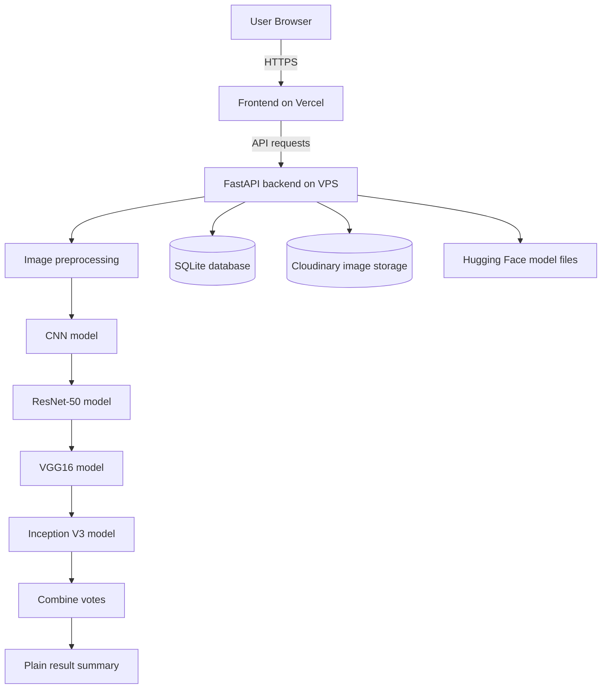
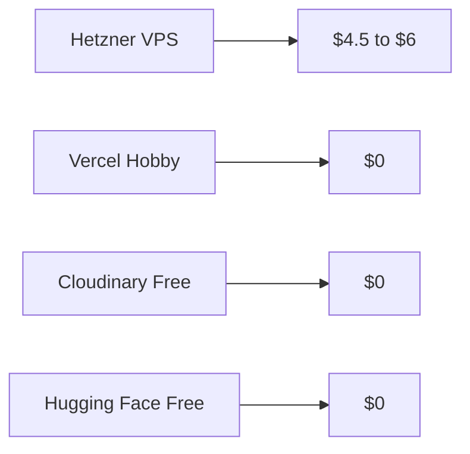

# Production Deployment Guide

This guide describes the production architecture for the project:

- `Frontend` on Vercel
- `Backend` on a small VPS
- `Model files` on Hugging Face
- `Image uploads` on Cloudinary
- `Database` on SQLite stored on the VPS

The goal is to keep the system affordable, always available, and still light enough to run on CPU.

## Architecture



## What This Setup Does

- keeps the frontend fast on Vercel
- keeps the backend always on, instead of sleeping on a free tier
- stores MRI uploads outside the VPS disk when Cloudinary is enabled
- loads the four ONNX models from a public Hugging Face repo
- keeps the result flow simple:
  - upload
  - preprocess
  - four model votes
  - combine votes
  - show the result

## 1. Backend on a VPS

Use a small Linux VPS such as Hetzner CX23 or a similar 2 vCPU / 4 GB RAM instance.

### Recommended server setup

- Ubuntu 22.04 or 24.04
- Python 3.11
- `nginx`
- `certbot`
- `systemd`

### Install steps

```bash
sudo apt update
sudo apt install -y python3.11 python3.11-venv python3-pip nginx certbot python3-certbot-nginx git
```

### Application setup

```bash
git clone https://github.com/TopoVista/MRI-Brain-Tumor-Detection-Agentic-AI.git
cd MRI-Brain-Tumor-Detection-Agentic-AI/backend
python3.11 -m venv .venv
source .venv/bin/activate
pip install -r requirements.txt
cp .env.example .env
```

### Backend environment

Use environment variables for all secrets and runtime flags.

```env
APP_NAME=Agentic MRI Analysis Copilot API
APP_ENV=production
API_PREFIX=/api
JWT_SECRET=<long-random-secret>
JWT_EXPIRE_MINUTES=120

SQLITE_PATH=storage/mri_copilot.db
CHROMA_PATH=chroma
STORAGE_PATH=storage/uploads
MODEL_CACHE_PATH=storage/model-cache

STRICT_PAPER_CORE=true
CACHE_ONNX_SESSIONS=true
SEED_KNOWLEDGE_BASE_ON_STARTUP=false

ADMIN_USERNAME=<admin-user>
ADMIN_PASSWORD_HASH=<bcrypt-hash-or-set-ADMIN_PASSWORD>
ADMIN_PASSWORD=

CNN_MODEL_URL=https://huggingface.co/<user>/topovista-mri-onnx/resolve/main/cnn.onnx
RESNET50_MODEL_URL=https://huggingface.co/<user>/topovista-mri-onnx/resolve/main/resnet50.onnx
VGG16_MODEL_URL=https://huggingface.co/<user>/topovista-mri-onnx/resolve/main/vgg16.onnx
INCEPTION_V3_MODEL_URL=https://huggingface.co/<user>/topovista-mri-onnx/resolve/main/inception_v3.onnx

CLOUDINARY_CLOUD_NAME=<cloud-name>
CLOUDINARY_API_KEY=<api-key>
CLOUDINARY_API_SECRET=<api-secret>
```

### systemd service

Create a service so the API restarts automatically.

```ini
[Unit]
Description=MRI Brain Tumor API
After=network.target

[Service]
WorkingDirectory=/opt/MRI-Brain-Tumor-Detection-Agentic-AI/backend
EnvironmentFile=/opt/MRI-Brain-Tumor-Detection-Agentic-AI/backend/.env
ExecStart=/opt/MRI-Brain-Tumor-Detection-Agentic-AI/backend/.venv/bin/uvicorn app.main:app --host 127.0.0.1 --port 8000
Restart=always
User=www-data

[Install]
WantedBy=multi-user.target
```

### nginx reverse proxy

Use nginx to expose the API on HTTPS.

```nginx
server {
    server_name api.yourdomain.com;

    location / {
        proxy_pass http://127.0.0.1:8000;
        proxy_set_header Host $host;
        proxy_set_header X-Real-IP $remote_addr;
        proxy_set_header X-Forwarded-For $proxy_add_x_forwarded_for;
        proxy_set_header X-Forwarded-Proto $scheme;
    }
}
```

Then run:

```bash
sudo certbot --nginx -d api.yourdomain.com
```

## 2. Frontend on Vercel

Deploy the `frontend/` folder to Vercel.

### Suggested settings

- `Framework`: Next.js
- `Root directory`: `frontend`
- `Build command`: `npm run build`

### Frontend environment

Set the backend URL to your VPS API:

```env
NEXT_PUBLIC_API_BASE_URL=https://api.yourdomain.com/api
```

## 3. Hugging Face model hosting

Upload the four ONNX files to a public Hugging Face repo:

- `cnn.onnx`
- `resnet50.onnx`
- `vgg16.onnx`
- `inception_v3.onnx`

Example repo:

- `TopoPanda/topovista-mri-onnx`

The backend downloads the files on first use and stores them in `storage/model-cache/`.

## 4. Cloudinary storage

Cloudinary stores the uploaded MRI images outside the VPS filesystem.

Set:

```env
CLOUDINARY_CLOUD_NAME=<cloud-name>
CLOUDINARY_API_KEY=<api-key>
CLOUDINARY_API_SECRET=<api-secret>
```

If Cloudinary is not configured, the backend falls back to local disk storage in development.

## 5. Auth hardening

The backend no longer depends on hardcoded login values.

Instead:

- users are stored in SQLite
- passwords are hashed with `passlib` + `bcrypt`
- the first admin account is seeded from environment variables

Recommended production values:

```env
ADMIN_USERNAME=<admin-user>
ADMIN_PASSWORD_HASH=<bcrypt-hash>
```

If you prefer local bootstrapping, you can set `ADMIN_PASSWORD` instead and let the backend hash it on startup.

## 6. Cost estimate



Approximate monthly cost:

- VPS: $4.50 to $6.00
- Vercel: $0
- Cloudinary: $0
- Hugging Face: $0

## 7. Deployment checklist

1. Put the four ONNX files on Hugging Face.
2. Set the backend environment variables on the VPS.
3. Start the backend with systemd.
4. Put nginx in front of the backend and enable HTTPS.
5. Deploy the frontend to Vercel.
6. Set `NEXT_PUBLIC_API_BASE_URL` to the VPS API URL.
7. Configure Cloudinary for image storage.
8. Log in with the seeded admin account and test one MRI upload.

## Notes

- The local setup still works on your machine with the four ONNX files in `artifacts/models/`.
- The hosted setup is designed for production-style uptime.
- The app remains decision support software, not an autonomous diagnostic tool.
