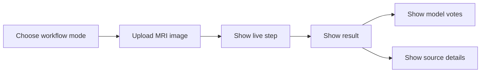

# Frontend

This is the Next.js UI for the brain MRI tumor classification and analysis system.

It keeps the interface simple:
- upload one MRI image
- show the current step
- show the result clearly
- keep the extra details available when needed

The UI supports two workflow modes:
- `Core mode`: upload, preprocess, four model votes, combine the result
- `Full workflow`: core mode plus sources, report text, checks, and case saving

## What The UI Shows

- upload card
- live step tracker
- result summary
- model votes
- image signals
- optional sources and checks when full workflow is selected

## Local Run

```powershell
cd frontend
npm install
copy .env.local.example .env.local
npm run dev
```

Open:
- `http://localhost:3000`

## Environment

```env
NEXT_PUBLIC_API_BASE_URL=http://localhost:8000/api
```

## UI Flow



## Notes

- The frontend expects the backend to be running on port `8000` in local development.
- The text in the UI is intentionally direct and easy to read.
- The layout is designed for clarity, not decoration.
- Core mode is the default.
- Full workflow is optional and only appears when selected in the upload panel.
