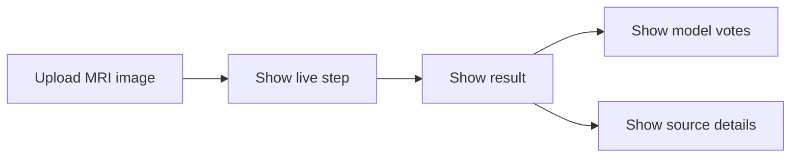

# Frontend

This is the Next.js interface for the brain MRI tumor classification system.

It is designed to do four simple things:
- upload one MRI image
- show the current workflow step
- show the result clearly
- keep the extra details available when needed

## What You See

- upload card
- live step tracker
- result summary
- model votes
- image signals
- optional sources and checks

## Local Run

```powershell
cd frontend
npm install
copy .env.local.example .env.local
npm run dev
```

Open:
- `http://localhost:3000`

## Environment

```env
NEXT_PUBLIC_API_BASE_URL=http://localhost:8000/api
```

## UI Flow



## Notes

- The frontend expects the backend to be running on port `8000` during local development.
- The wording in the UI is intentionally plain and direct.
- The layout is meant to be clear and readable, not flashy.

