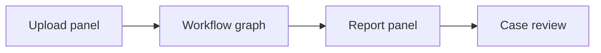

# Frontend

This is the Next.js UI for the MRI copilot.

It is built to support a local backend at `http://localhost:8000/api` and render the full workflow:

- upload MRI scan
- show live workflow stages
- render the report in readable sections
- surface model votes and case details

## Local Run

```powershell
cd frontend
npm install
copy .env.local.example .env.local
npm run dev
```

Open:

- `http://localhost:3000`

## Environment

```env
NEXT_PUBLIC_API_BASE_URL=http://localhost:8000/api
```

## UI Flow



## Notes

- The frontend expects the backend to be running locally on port `8000`.
- If the backend is not available, uploads will fail.
- The UI is intentionally compact and clinical, not marketing-oriented.

